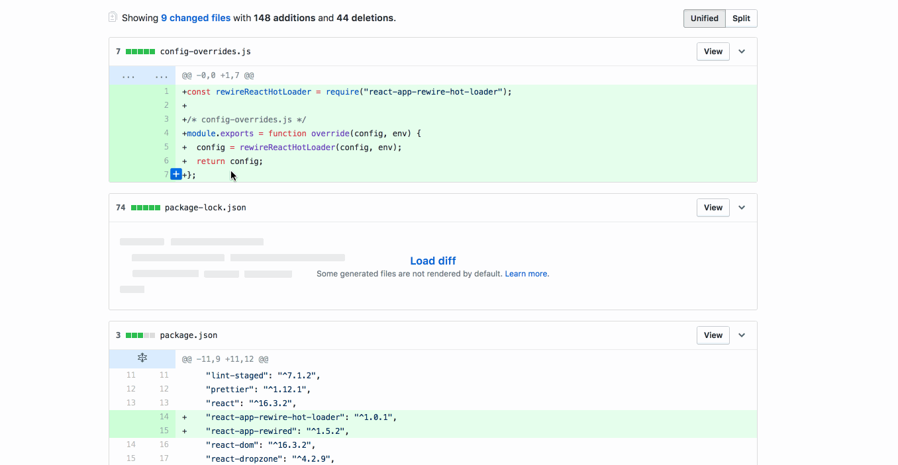
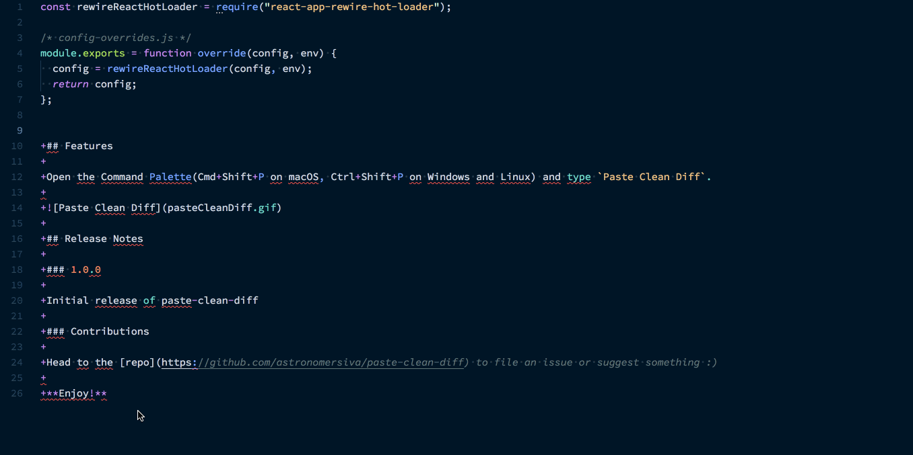

# paste-clean-diff README

A VSCode extension to paste Git diffs without leading plus and minus signs.

## Features

Open the Command Palette(Cmd+Shift+P on macOS, Ctrl+Shift+P on Windows and Linux) and type `Paste Clean Diff`.

To clean up an already pasted diff, select the diff and then choose `Clean Diff` from the Command Palette.

## Release Notes

### 1.1.0

Support cleaning already pasted diff

### 1.0.0

Initial release of paste-clean-diff

### Contributions

Head to the [repo](https://github.com/astronomersiva/paste-clean-diff) to file an issue or suggest something :)

**Enjoy!**
